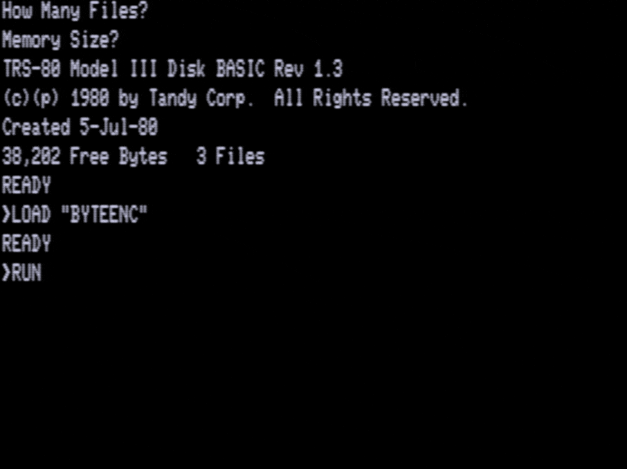

# RSA
## By the power of ~Greyskull~Two!

RSA in 1980's BASIC, found in Hackerbibel and Byte magazine.

BASIC files should compile – despite the age – using [QB64](https://www.qb64.org/portal/) on Mac, Windows and Linux.

Encryption on a TRS-80:

